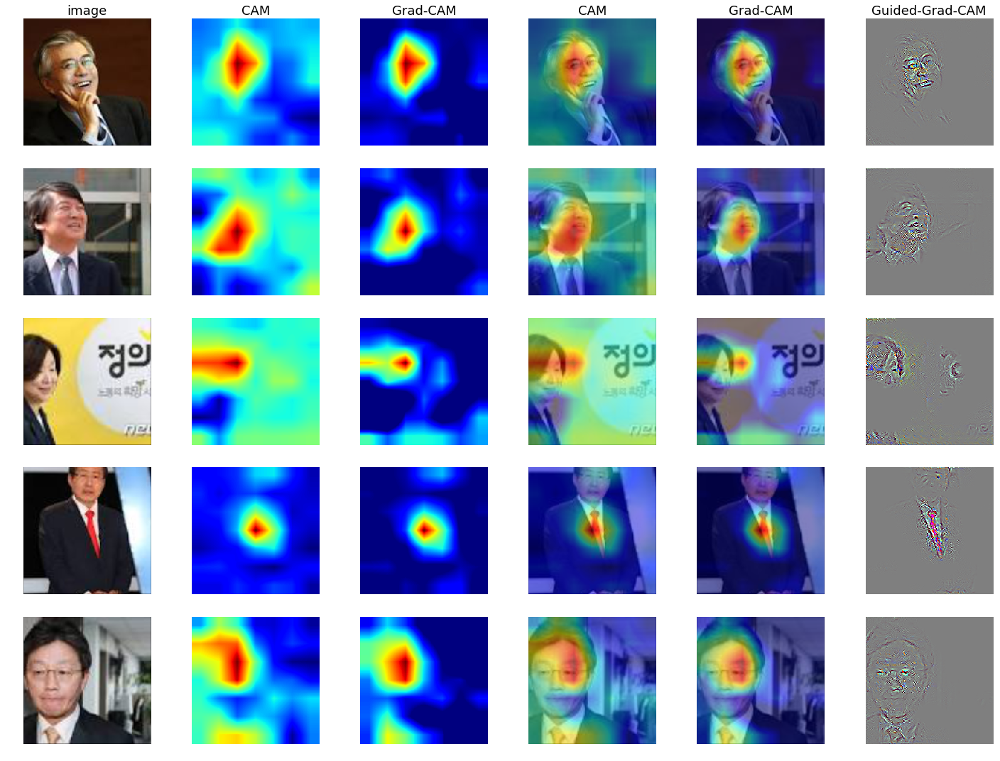

## Grad-CAM and CAM implementation with Keras

This repo contains Keras implementation of CAM, Grad-CAM, Guided Grad-CAM on the 2017 Korean presidential election candidates' face image data. 

## Original Paper links
CAM: 
Grad-CAM: <a href="https://arxiv.org/abs/1610.02391">https://arxiv.org/abs/1610.02391</a>
Guided Backpropagation: <a href="https://arxiv.org/abs/1412.6806">https://arxiv.org/abs/1412.6806</a>

## Data Source
I crawled the original images from Google and cropped faces myself. The dataset is available for any research purposes.
<a href="https://www.floydhub.com/junkwhinger/datasets/presidential_candidates_2017_v2">https://www.floydhub.com/junkwhinger/datasets/presidential_candidates_2017_v2</a>

## Related Blogposts (in Korean)
### Transfer Learning: 대선주자 얼굴 분류기
<a href="http://jsideas.net/python/2017/05/07/transfer_learning.html">http://jsideas.net/python/2017/05/07/transfer_learning.html</a>

### Transfer Learning wtih Keras on FloydHub
<a href="http://jsideas.net/python/2017/11/26/transfer_learning_with_keras_on_floydhub.html">http://jsideas.net/python/2017/11/26/transfer_learning_with_keras_on_floydhub.html</a>

### CAM: 대선주자 얼굴 위치 추적기
<a href="http://jsideas.net/python/2018/01/04/class_activation_map.html">http://jsideas.net/python/2018/01/04/class_activation_map.html</a>

### Grad-CAM: 대선주자 얼굴 위치 추적기
<a href="http://jsideas.net/python/2018/01/12/grad_cam.html">http://jsideas.net/python/2018/01/12/grad_cam.html</a>

## Acknowledgement
### Keras implementation of class activation mapping
<a href="https://github.com/jacobgil/keras-cam">https://github.com/jacobgil/keras-cam</a>

### Grad-CAM implementation in Keras
<a href="https://github.com/jacobgil/keras-grad-cam#grad-cam-implementation-in-keras">https://github.com/jacobgil/keras-grad-cam#grad-cam-implementation-in-keras</a>

### Grad-CAM-tensorflow
<a href="https://github.com/insikk/Grad-CAM-tensorflow">https://github.com/insikk/Grad-CAM-tensorflow</a>
